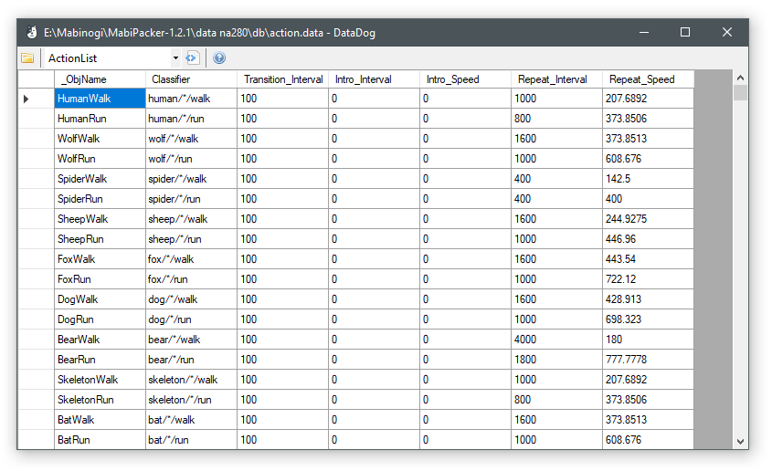

DataDog
=============================================================================

DataDog is a viewer and editor for Mabinogi's .data (DataDog) format.
It allows you to open and view the files, export them to XML, and
edit them, modfying existing values or removing and adding objects.

Editing is currently experimental, please report any issues.

Preview
-----------------------------------------------------------------------------

Links
-----------------------------------------------------------------------------

- GitHub: https://github.com/exectails/DataDog
